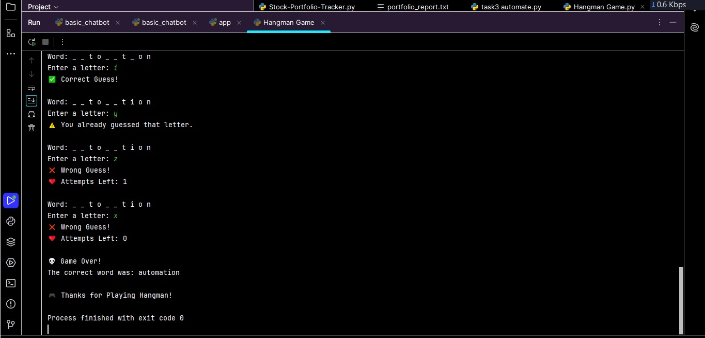

# CodeAlpha Hangman Game
##  About the Project
This project was developed as part of the **CodeAlpha Python Programming Internship**.The Hangman Game is a Python-based word guessing game where the program randomly selects a word, and the player guesses one letter at a time. The game displays the correctly guessed letters, tracks incorrect guesses, and ends when the player guesses the word or runs out of attempts.
##  Features
- 🎮 Random word selection
- 🔤 Letter-by-letter guessing
- ❌ Tracks incorrect guesses
- ❤️ Limited attempts
- 🏆 Win and Game Over messages
- 😊 Easy-to-use command-line interface
## Technologies Used
- Python 3
- PyCharm IDE
- Random Module
- Loops
- Conditional Statements
- Lists & Strings
##  Project Structure
```
CodeAlpha_HangmanGame/
│── hangman_game.py
│── README.md
│── screenshot.jpeg
```
## How to Run
1. Open the project in PyCharm.
2. Run the `hangman_game.py` file.
3. Guess one letter at a time.
4. Continue guessing until you find the complete word or run out of attempts.
##  Developed By
**Saira Ijaz**
## Internship
This project was created for the **CodeAlpha Python Programming Internship**.
##  Project Screenshot

